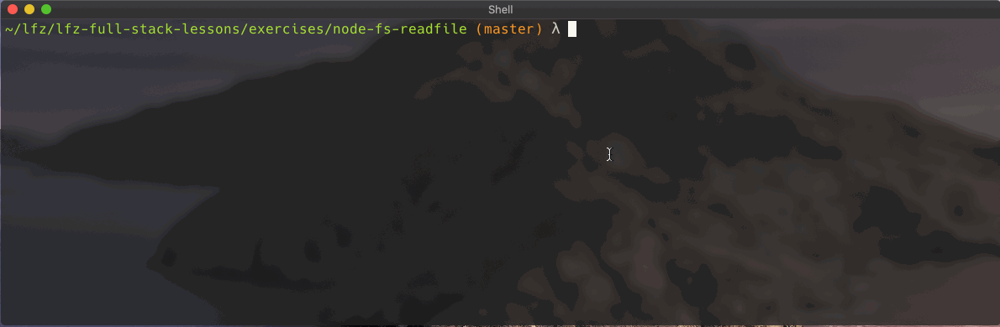
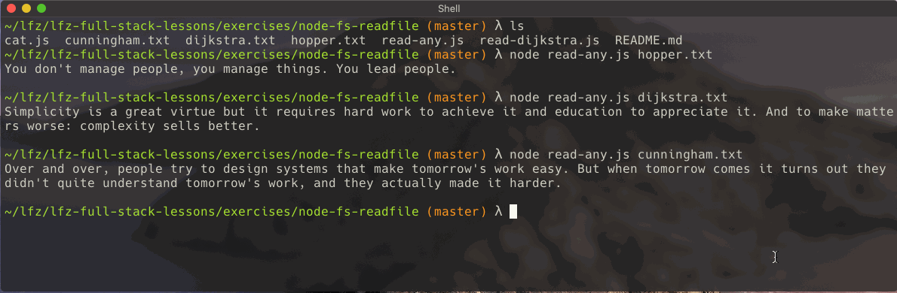

# node-fs-readfile

This lesson introduces the `fs` module built into Node.js, allowing JavaScript programs to access and manipulate the operating system's files.

### Quiz

After completing this exercise, you should be able to discuss or answer the following questions:

- What is a directory?
- What is a relative file path?
- What is an absolute file path?
- What module does Node.js include for manipulating the file system?

### Before You Begin

Be sure to check out a new branch (from `master`) for this exercise. Detailed instructions can be found [**here**](../../guides/before-each-exercise.md). Then navigate to the `exercises/node-fs-readfile` directory in your terminal.

### Introduction

A [file system](https://en.wikipedia.org/wiki/File_system) is a way of organizing data on a storage medium. Examples of storage mediums include hard disk drives, flash drives, and optical disks. File systems are typically organized in a hierarchy of directories, beginning with a "root" directory. On UNIX-like systems, this "root" directory is denoted by a `/` slash.

### Exercise

#### Level 1 (Required)

1. Read the introductory section of the [`File System` module](https://nodejs.org/docs/latest-v10.x/api/fs.html#fs_file_system) in the official Node.js documentation.
1. Read about the [`readFile` method](https://nodejs.org/docs/latest-v10.x/api/fs.html#fs_fs_readfile_path_options_callback) of the `fs` module in the official Node.js documentation.
1. Within `read-dijkstra.js`, call the `require()` function to import the `'fs'` module.
1. Use `fs.readFile` to read the contents of `dijkstra.txt` and print it to the terminal.

  

#### Level 2 (Required)

1. Create a new file named `read-any.js`.
1. Within `read-any.js` use `fs.readFile` and `process.argv` to print the contenst of any specified file to the terminal.

  

#### Level 3 (Optional) - ONLY DO AFTER LEVELS 1 AND 2 ARE TURNED IN

1. Create a new file named `cat.js` that can take any number of files via `process.arv`, concatenate their contents, and print the result to the terminal (just like the `cat` command). **Guarantee that the order of the combined contents match the order of the file names passed to the program.** A large `hipster-ipsum.txt` has been included for testing purposes.

  

### Submitting Your Solution

When your solution is complete, return to the root of your `lfz-full-stack-lessons` directory. Then commit your changes, push, and submit a Pull Request on GitHub. Detailed instructions can be found [**here**](../../guides/after-each-exercise.md).
