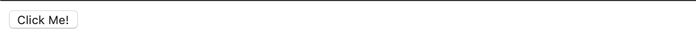

# react-function-components

Creating reusable components in React.

### Quiz

After completing this exercise, you should be able to discuss or answer the following questions:

- What is a React component?
- How do you define a function component in React?
- How do you mount a component to the DOM?

### Before You Begin

Be sure to check out a new branch (from `master`) for this exercise. Detailed instructions can be found [**here**](../../guides/before-each-exercise.md). Then navigate to the `exercises/react-function-components` directory in your terminal.

### Exercise

1. Read about [components](https://reactjs.org/docs/components-and-props.html) in the official React documentation.
1. Create a new `package.json` and install the following:
    - `dependencies`
      - `react`
      - `react-dom`
    - `devDependencies`
      - `webpack`
      - `webpack-cli`
      - `babel-loader`
      - `@babel/core`
      - `@babel/plugin-transform-react-jsx`
1. Create a `webpack.config.js` and add the following JavaScript to it.
    ```js
    module.exports = {
      resolve: {
        extensions: ['.js', '.jsx']
      },
      module: {
        rules: [
          {
            test: /\.jsx?$/,
            use: {
              loader: 'babel-loader',
              options: {
                plugins: [
                  '@babel/plugin-transform-react-jsx'
                ]
              }
            }
          }
        ]
      }
    };
    ```
1. Add a `"build"` script to your `package.json` that runs `webpack`.
1. Create two directories - `src` and `dist`.
1. Add an `index.jsx` to `src` and an `index.html` to `dist`.
1. Within `dist/index.html`:
    - Create an HTML skeleton.
    - Add a `div` with the id `"root"`.
    - Add a `script` tag for `"main.js"`.
1. Within `index.jsx`:
    - Import `React` from the `"react"` package.
    - Import `ReactDOM` from the `"react-dom"` package.
    - Define a function component named `CustomButton` that returns JSX for a `<button>` that says "Click Me!".
    - Use [`ReactDOM.render`](https://reactjs.org/docs/react-dom.html#render) to mount your `CustomButton` component to your `div#root` element.
1. Run your `"build"` script by doing `npm run build` in your terminal.
1. Open `dist/index.html` in your browser to see your rendered button.
    
1. **Note:** Webpack does not automatically recompile your JSX code. You must re-run your `"build"` script to create a new `main.js` (or add an NPM script named `watch` that runs `webpack --watch`).

### Submitting Your Solution

When your solution is complete, return to the root of your `lfz-full-stack-lessons` directory. Then commit your changes, push, and submit a Pull Request on GitHub. Detailed instructions can be found [**here**](../../guides/after-each-exercise.md).
